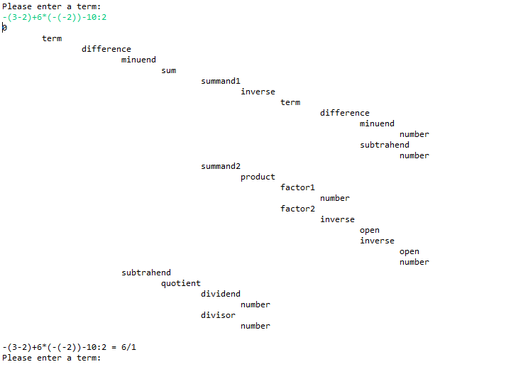

# com.florianingerl.math.termcalculator

## Purpose of this project
The purpose of this project is to test the ["CaptureTree"](https://github.com/florianingerl/com.florianingerl.util.regex#capture-trees)-feature of the `com.florianingerl.util.regex`-library and its usefulness in parsing recursive constructs such as mathematical terms.

## What this program does?
The program asks the users to input a mathematical term such as `-(3-2)+6*(-(-2))-10:2` . This term will then be parsed using the regex in [term1.regex](src/main/resources/term1.regex). After parsing, the so-called "CaptureTree" is printed to the console. Then the value of the term is calculated and also printed to the console.

A typical output looks like this:

## How to run the program?
Download this repository and build the project with `mvn package`. Then run the program with `java -jar target/termcalculator-1.1.1-jar-with-dependencies.jar`.